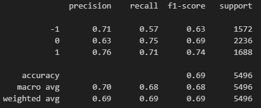
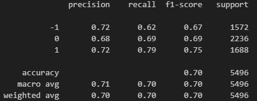
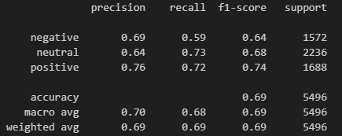
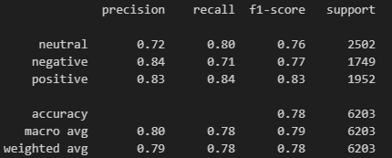

# Model Selection

### Goal
The aim is to select a model for text classification to use for sentiment analysis of Reddit posts. The model must classify text into three classes: 'positive,' 'negative,' and 'neutral'.

### Results
A variety of [ML models](ml_models.ipynb) have been evaluated. The One-vs-Rest classifier from scikit-learn with Logistic Regression and Random Forest Classifier had accuracies of 69% and 70%, respectively. The XGBoost classifier had a similar accuracy of 69%. The [best model](BERT_model_finetuning.ipynb) was the fine-tuned BERT model for sequence classification, achieving an accuracy of 78%.

- One-vs-Rest (classifier: Logistic Regression)  

- One-vs-Rest (classifier: Random Forest Classifier)  

- XGBoost Classifier

- Finetuned BERT model for Sequence Classfication

